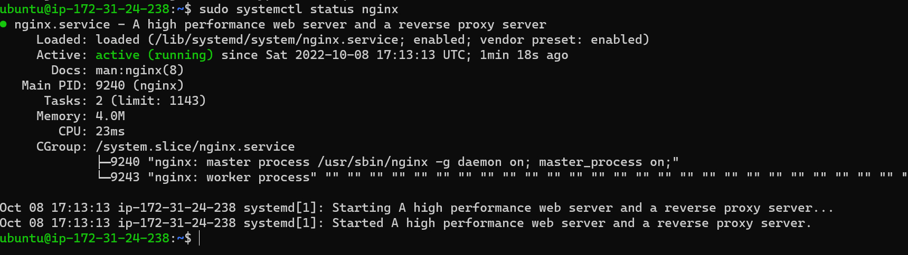
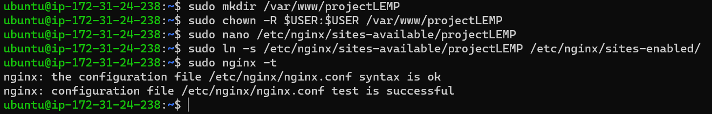
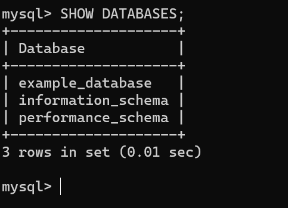
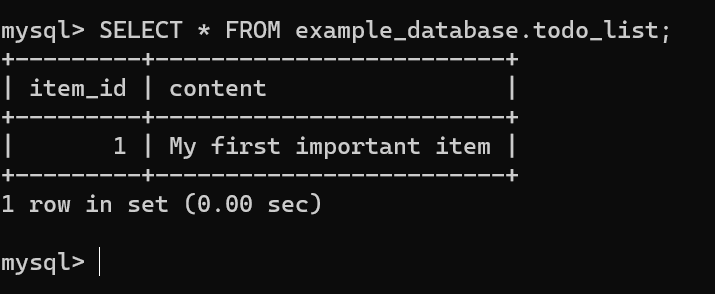

## Project 2 Documentation

##### LEMP STACK IMPLEMENTATION which include 
1. Nginx 
1. Mysql
1. PHP
1.  configuring nginx to use php processor
1. testing php with nginx
1. retrieving data from mysql database with php

### Installing Nginx
#### STEP 1 – INSTALLING THE NGINX WEB SERVER
`sudo apt update`

`sudo apt install nginx`

`sudo systemctl status nginx`


### Installing MySQL
`sudo apt install mysql-server`
`sudo mysql`

### Installing Php
`sudo apt install php-fpm php-mysql`


### CONFIGURING NGINX TO USE PHP PROCESSOR
`sudo mkdir /var/www/projectLEMP`

`sudo chown -R $USER:$USER /var/www/projectLEMP`

`sudo nano /etc/nginx/sites-available/projectLEMP`

The above will create a new blank file. Paste in the following bare-bones configuration:

#/etc/nginx/sites-available/projectLEMP
```
server {
    listen 80;
    server_name projectLEMP www.projectLEMP;
    root /var/www/projectLEMP;

    index index.html index.htm index.php;

    location / {
        try_files $uri $uri/ =404;
    }

    location ~ \.php$ {
        include snippets/fastcgi-php.conf;
        fastcgi_pass unix:/var/run/php/php8.1-fpm.sock;
     }

    location ~ /\.ht {
        deny all;
    }

}
```
Save and Quit

This will tell Nginx to use the configuration next time it is reloaded. You can test your configuration for syntax errors by typing:

`sudo ln -s /etc/nginx/sites-available/projectLEMP /etc/nginx/sites-enabled/`

`sudo nginx -t`

`sudo systemctl reload nginx`

You shall see following message:


If any errors are reported, go back to your configuration file to review its contents before continuing.

We also need to disable default Nginx host that is currently configured to listen on port 80, for this run:

`sudo unlink /etc/nginx/sites-enabled/default`

When you are ready, reload Nginx to apply the changes:

`sudo systemctl reload nginx`

Your new website is now active, but the web root /var/www/projectLEMP is still empty. Create an index.html file in that location so that we can test that your new server block works as expected:

`sudo echo 'Hello LEMP from hostname' $(curl -s http://169.254.169.254/latest/meta-data/public-hostname) 'with public IP' $(curl -s http://169.254.169.254/latest/meta-data/public-ipv4) > /var/www/projectLEMP/index.html`

Now go to your browser and try to open your website URL using IP address:


http://Public-IP-Address:80
If you see the text from ‘echo’ command you wrote to index.html file, then it means your Nginx site is working as expected.
In the output you will see your server’s public hostname (DNS name) and public IP address. You can also access your website in your browser by public DNS name, not only by IP – try it out, the result must be the same (port is optional)

### TESTING PHP WITH NGINX
Your LEMP stack should now be completely set up.

At this point, your LAMP stack is completely installed and fully operational.

You can test it to validate that Nginx can correctly hand .php files off to your PHP processor.

You can do this by creating a test PHP file in your document root. Open a new file called info.php within your document root in your text editor:

`sudo nano /var/www/projectLEMP/info.php`

Type or paste the following lines into the new file. This is valid PHP code that will return information about your server:
```
 <?php
phpinfo();

```

You can now access this page in your web browser by visiting the domain name or public IP address you’ve set up in your Nginx configuration file, followed by /info.php:

http://`server_domain_or_IP`/info.php
You will see a web page containing detailed information about your server:


After checking the relevant information about your PHP server through that page, it’s best to remove the file you created as it contains sensitive information about your PHP environment and your Ubuntu server. You can use rm to remove that file:

`sudo rm /var/www/your_domain/info.php`
You can always regenerate this file if you need it later.


### RETRIEVING DATA FROM MYSQL DATABASE WITH PHP
`sudo mysql` 

`mysql-p`

`mysql> CREATE DATABASE `example_database`;`

`mysql>  CREATE USER 'example_user'@'%' IDENTIFIED WITH mysql_native_password BY 'password';`

Now we need to give this user permission over the example_database database:

`mysql> GRANT ALL ON example_database.* TO 'example_user'@'%';`
This will give the example_user user full privileges over the example_database database, while preventing this user from creating or modifying other databases on your server.

Now exit the MySQL shell with:

`mysql> exit`

You can test if the new user has the proper permissions by logging in to the MySQL console again, this time using the custom user credentials:

`mysql -u example_user -p`
[New User](./images/NewUserMySQL.png)

Notice the -p flag in this command, which will prompt you for the password used when creating the example_user user. After logging in to the MySQL console, confirm that you have access to the example_database database:

mysql> SHOW DATABASES;

This will give you the following output:



Next, we’ll create a test table named todo_list. From the MySQL console, run the following statement:
```
CREATE TABLE example_database.todo_list (
mysql>     item_id INT AUTO_INCREMENT,
mysql>     content VARCHAR(255),
mysql>     PRIMARY KEY(item_id)
mysql> );

Insert a few rows of content in the test table. You might want to repeat the next command a few times, using different VALUES:
```
`mysql> INSERT INTO example_database.todo_list (content) VALUES ("My first important item");`

To confirm that the data was successfully saved to your table, run:

`mysql>  SELECT * FROM example_database.todo_list;`

You’ll see the following output:


`mysql> exit`

Now you can create a PHP script that will connect to MySQL and query for your content. Create a new PHP file in your custom web root directory using your preferred editor. We’ll use vi for that:

`nano /var/www/projectLEMP/todo_list.php`
The following PHP script connects to the MySQL database and queries for the content of the todo_list table, displays the results in a list. If there is a problem with the database connection, it will throw an exception.

Copy this content into your todo_list.php script:
```
<?php
$user = "example_user";
$password = "password";
$database = "example_database";
$table = "todo_list";

try {
  $db = new PDO("mysql:host=localhost;dbname=$database", $user, $password);
  echo "<h2>TODO</h2><ol>";
  foreach($db->query("SELECT content FROM $table") as $row) {
    echo "<li>" . $row['content'] . "</li>";
  }
  echo "</ol>";
} catch (PDOException $e) {
    print "Error!: " . $e->getMessage() . "<br/>";
    die();
}
```
Save and close the file when you are done editing.

You can now access this page in your web browser by visiting the domain name or public IP address configured for your website, followed by /todo_list.php


